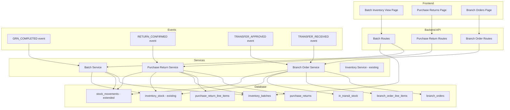
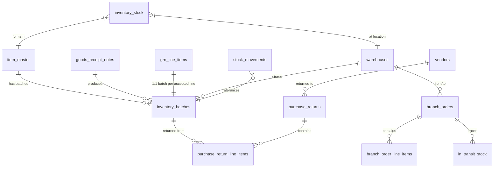

# Design Document: Batch Inventory ERP

## Overview

This design introduces ERP-grade batch-controlled inventory management to ProcureTrack. The system evolves from simple quantity-based tracking to full batch-level traceability, covering four core capabilities:

1. **Batch Auto-Generation** — When a GRN completes, the system automatically creates uniquely numbered batch records per accepted line item.
2. **Purchase Returns** — Users create return documents against specific batches, with full financial calculations and inventory adjustments.
3. **Batch Inventory View** — A read-only view presenting inventory organized by batch with financial valuations.
4. **Branch Orders (Stock Transfers)** — Inter-location transfer requests with a full lifecycle from creation through in-transit tracking to receipt.

The design integrates tightly with existing modules (GRN, inventory_stock, stock_movements) via the established event-driven pattern and maintains the critical invariant: sum of batch quantities always equals overall inventory stock.

## Architecture



### Design Decisions

1. **Event-driven batch creation** — Batch records are created by subscribing to the existing `GRN_COMPLETED` event, consistent with how `receiveStockFromGrn` already works. This keeps GRN logic decoupled from batch logic.

2. **Batch number as business key** — The format `{ItemCode}-{LocationCode}-{YYYYMMDD}-{Seq}` provides human-readable traceability. A retry loop handles sequence collisions.

3. **Dual-ledger approach** — Both `inventory_batches.qty_available` and `inventory_stock.quantity_on_hand` are maintained in lockstep. The invariant (sum of batches = stock) is enforced at the service layer via transactions.

4. **In-transit as a separate table** — Rather than using status flags on stock rows, a dedicated `in_transit_stock` table provides clear visibility into goods between locations.

5. **Stock movements extended (not replaced)** — New movement types (`batch_in`, `return_out`, `transfer_out`, `transfer_in`, `consumption`) are added to the existing ENUM, preserving backward compatibility.

6. **Purchase return uses batch-level precision** — Returns reference specific batches, not just item/warehouse, enabling lot-level recall and vendor dispute resolution.

## Components and Interfaces

### Backend Services

#### 1. Batch Service (`backend/src/modules/inventory/batch.service.js`)

| Function | Description |
|----------|-------------|
| `generateBatchesFromGrn(grnPayload, conn)` | Event handler for GRN_COMPLETED. Creates batch records per accepted line. |
| `generateBatchNumber(itemCode, locationCode, date, conn)` | Generates unique batch number with retry on collision. |
| `getBatches(filters, conn)` | Query batches with optional filters (item, location, batch_number, includeExhausted). |
| `consumeFromBatch(batchId, quantity, reference, actorId, conn)` | Reduces batch qty_available and inventory_stock. Marks exhausted if zero. |
| `getBatchById(batchId, conn)` | Fetch single batch with item and location details. |

#### 2. Purchase Return Service (`backend/src/modules/inventory/purchaseReturn.service.js`)

| Function | Description |
|----------|-------------|
| `createPurchaseReturn(input, actorId, conn)` | Creates a draft purchase return with header and line items. Validates batch availability. |
| `updatePurchaseReturn(returnId, input, actorId, conn)` | Updates draft return header/lines. Rejects if not in draft status. |
| `confirmPurchaseReturn(returnId, actorId, conn)` | Transitions to confirmed. Reduces batch qty_available and inventory_stock. Records stock_movements. |
| `getPurchaseReturns(filters, conn)` | List returns with filters (status, vendor, date range). |
| `getPurchaseReturnById(returnId, conn)` | Fetch single return with line items and batch details. |
| `generateReturnNumber(conn)` | Generates sequential PR-RET-XXXXXX number. |
| `calculateLineAmount(qty, rate, discountPct, taxPct)` | Pure function: `(qty * rate) * (1 - discount/100) * (1 + tax/100)`. |

#### 3. Branch Order Service (`backend/src/modules/inventory/branchOrder.service.js`)

| Function | Description |
|----------|-------------|
| `createBranchOrder(input, actorId, conn)` | Creates a branch order request. Validates stock availability at source. |
| `approveBranchOrder(orderId, actorId, conn)` | Transitions to approved. Reduces source stock. Creates in-transit records. |
| `dispatchBranchOrder(orderId, actorId, conn)` | Transitions to in_transit. Records transfer_out stock_movements. |
| `receiveBranchOrder(orderId, receivedLines, actorId, conn)` | Transitions to received. Increases destination stock. Removes in-transit. Logs variance if qty differs. |
| `getBranchOrders(filters, conn)` | List orders with filters (status, from/to location, date). |
| `getBranchOrderById(orderId, conn)` | Fetch single order with line items. |
| `getAvailableStockAtLocation(locationId, conn)` | Returns stock per item at a specific warehouse. |

### Backend Routes

#### Batch Routes (`/api/inventory/batches`)

| Method | Path | Description |
|--------|------|-------------|
| GET | `/api/inventory/batches` | List batches with filters |
| GET | `/api/inventory/batches/:id` | Get single batch detail |
| POST | `/api/inventory/batches/consume` | Consume stock from a specific batch |

#### Purchase Return Routes (`/api/inventory/purchase-returns`)

| Method | Path | Description |
|--------|------|-------------|
| GET | `/api/inventory/purchase-returns` | List returns with filters |
| GET | `/api/inventory/purchase-returns/:id` | Get single return with lines |
| POST | `/api/inventory/purchase-returns` | Create draft return |
| PUT | `/api/inventory/purchase-returns/:id` | Update draft return |
| POST | `/api/inventory/purchase-returns/:id/confirm` | Confirm return (triggers inventory adjustments) |
| GET | `/api/inventory/purchase-returns/eligible-batches` | Get batches eligible for return (filters: grn_date_from, grn_date_to, batch_number, vendor_id) |

#### Branch Order Routes (`/api/inventory/branch-orders`)

| Method | Path | Description |
|--------|------|-------------|
| GET | `/api/inventory/branch-orders` | List orders with filters |
| GET | `/api/inventory/branch-orders/:id` | Get single order with lines |
| POST | `/api/inventory/branch-orders` | Create order request |
| POST | `/api/inventory/branch-orders/:id/approve` | Approve order |
| POST | `/api/inventory/branch-orders/:id/dispatch` | Mark as dispatched/in-transit |
| POST | `/api/inventory/branch-orders/:id/receive` | Confirm receipt |
| GET | `/api/inventory/branch-orders/available-stock/:locationId` | Get available stock at a location |

### Frontend Pages

#### 1. Batch Inventory View (`frontend/src/pages/BatchInventory.jsx`)

- Table displaying batch records with financial calculations
- Filters: item_code, batch_number, location (dropdown)
- Toggle: "Show Exhausted Batches" (default off)
- Click-to-expand for movement history per batch
- Columns: Item Code, Item Name, Batch Number, Location, Qty Available, Rate, Discount %, Tax %, Total Amount

#### 2. Purchase Returns (`frontend/src/pages/PurchaseReturns.jsx`)

- List view with status tags (draft/confirmed/closed)
- Create/Edit form: header fields + dynamic line items table
- Batch picker: searchable dropdown filtered by eligible batches
- Auto-calculated line amounts and invoice total
- Confirm action with confirmation modal

#### 3. Branch Orders (`frontend/src/pages/BranchOrders.jsx`)

- List view with status lifecycle badges
- Create form: from/to location selectors, request type (sub-master dropdown)
- Line items with available-stock display from source location
- Status progression actions: Approve, Dispatch, Receive
- Receive form allows entering actual received quantities

### API Contracts

#### POST `/api/inventory/purchase-returns`

**Request:**
```json
{
  "vendor_id": "uuid",
  "grn_id": "uuid",
  "asn_number": "ASN-000001",
  "return_date": "2025-01-15",
  "return_reason": "Damaged goods",
  "round_off": 0.50,
  "line_items": [
    {
      "item_master_id": "uuid",
      "batch_id": "uuid",
      "batch_number": "ITEM001-WH01-20250110-001",
      "location_id": "uuid",
      "return_quantity": 10,
      "rate": 150.00,
      "discount_percentage": 5,
      "tax_percentage": 18
    }
  ]
}
```

**Response (201):**
```json
{
  "success": true,
  "data": {
    "id": "uuid",
    "return_number": "PR-RET-000001",
    "status": "draft",
    "vendor_id": "uuid",
    "total_amount": 1606.05,
    "line_items": [...]
  }
}
```

#### POST `/api/inventory/branch-orders`

**Request:**
```json
{
  "from_location_id": "uuid",
  "to_location_id": "uuid",
  "request_type": "inter_branch_transfer",
  "request_date": "2025-01-15",
  "remarks": "Stock replenishment for branch",
  "line_items": [
    {
      "item_master_id": "uuid",
      "requested_quantity": 50
    }
  ]
}
```

**Response (201):**
```json
{
  "success": true,
  "data": {
    "id": "uuid",
    "order_number": "BO-000001",
    "status": "created",
    "from_location_id": "uuid",
    "to_location_id": "uuid",
    "line_items": [...]
  }
}
```

#### POST `/api/inventory/branch-orders/:id/receive`

**Request:**
```json
{
  "received_lines": [
    {
      "line_item_id": "uuid",
      "received_quantity": 48
    }
  ]
}
```

**Response (200):**
```json
{
  "success": true,
  "data": {
    "id": "uuid",
    "status": "received",
    "variances": [
      { "item_master_id": "uuid", "approved_qty": 50, "received_qty": 48, "variance": -2 }
    ]
  }
}
```

#### GET `/api/inventory/batches`

**Query Params:** `item_code`, `batch_number`, `location_id`, `include_exhausted` (boolean)

**Response (200):**
```json
{
  "success": true,
  "data": [
    {
      "id": "uuid",
      "batch_number": "ITEM001-WH01-20250110-001",
      "item_code": "ITEM001",
      "item_name": "Steel Rod 10mm",
      "location_name": "Main Warehouse",
      "qty_received": 100,
      "qty_available": 85,
      "rate": 150.00,
      "discount_percentage": 5,
      "tax_percentage": 18,
      "total_amount": 14363.25,
      "status": "active",
      "created_at": "2025-01-10T10:00:00Z"
    }
  ]
}
```

## Data Models

### New Tables

#### `inventory_batches`

```sql
CREATE TABLE IF NOT EXISTS inventory_batches (
  id VARCHAR(36) PRIMARY KEY,
  batch_number VARCHAR(100) UNIQUE NOT NULL,
  item_master_id VARCHAR(36) NOT NULL,
  grn_id VARCHAR(36) NOT NULL,
  grn_line_item_id VARCHAR(36) NOT NULL,
  location_id VARCHAR(36) NOT NULL,
  qty_received DECIMAL(15,3) NOT NULL,
  qty_available DECIMAL(15,3) NOT NULL DEFAULT 0,
  rate DECIMAL(15,2) NOT NULL DEFAULT 0,
  discount_percentage DECIMAL(5,2) NOT NULL DEFAULT 0,
  tax_percentage DECIMAL(5,2) NOT NULL DEFAULT 0,
  status ENUM('active','exhausted') NOT NULL DEFAULT 'active',
  created_at TIMESTAMP DEFAULT CURRENT_TIMESTAMP,
  updated_at TIMESTAMP DEFAULT CURRENT_TIMESTAMP ON UPDATE CURRENT_TIMESTAMP,
  FOREIGN KEY (item_master_id) REFERENCES item_master(id),
  FOREIGN KEY (grn_id) REFERENCES goods_receipt_notes(id),
  FOREIGN KEY (grn_line_item_id) REFERENCES grn_line_items(id),
  FOREIGN KEY (location_id) REFERENCES warehouses(id),
  INDEX idx_batch_item (item_master_id),
  INDEX idx_batch_location (location_id),
  INDEX idx_batch_grn (grn_id),
  INDEX idx_batch_status (status)
);
```

#### `purchase_returns`

```sql
CREATE TABLE IF NOT EXISTS purchase_returns (
  id VARCHAR(36) PRIMARY KEY,
  return_number VARCHAR(50) UNIQUE NOT NULL,
  vendor_id VARCHAR(36) NOT NULL,
  grn_id VARCHAR(36) NOT NULL,
  asn_number VARCHAR(50) NULL,
  return_date DATE NOT NULL,
  return_reason TEXT NOT NULL,
  status ENUM('draft','confirmed','closed') NOT NULL DEFAULT 'draft',
  round_off DECIMAL(10,2) NOT NULL DEFAULT 0,
  total_amount DECIMAL(15,2) NOT NULL DEFAULT 0,
  created_by VARCHAR(36) NULL,
  confirmed_by VARCHAR(36) NULL,
  confirmed_at TIMESTAMP NULL,
  created_at TIMESTAMP DEFAULT CURRENT_TIMESTAMP,
  updated_at TIMESTAMP DEFAULT CURRENT_TIMESTAMP ON UPDATE CURRENT_TIMESTAMP,
  FOREIGN KEY (vendor_id) REFERENCES vendors(id),
  FOREIGN KEY (grn_id) REFERENCES goods_receipt_notes(id),
  INDEX idx_pr_vendor (vendor_id),
  INDEX idx_pr_status (status),
  INDEX idx_pr_date (return_date)
);
```

#### `purchase_return_line_items`

```sql
CREATE TABLE IF NOT EXISTS purchase_return_line_items (
  id VARCHAR(36) PRIMARY KEY,
  purchase_return_id VARCHAR(36) NOT NULL,
  item_master_id VARCHAR(36) NOT NULL,
  batch_id VARCHAR(36) NOT NULL,
  batch_number VARCHAR(100) NOT NULL,
  location_id VARCHAR(36) NOT NULL,
  return_quantity DECIMAL(15,3) NOT NULL,
  rate DECIMAL(15,2) NOT NULL,
  discount_percentage DECIMAL(5,2) NOT NULL DEFAULT 0,
  tax_percentage DECIMAL(5,2) NOT NULL DEFAULT 0,
  line_amount DECIMAL(15,2) NOT NULL DEFAULT 0,
  FOREIGN KEY (purchase_return_id) REFERENCES purchase_returns(id) ON DELETE CASCADE,
  FOREIGN KEY (item_master_id) REFERENCES item_master(id),
  FOREIGN KEY (batch_id) REFERENCES inventory_batches(id),
  FOREIGN KEY (location_id) REFERENCES warehouses(id),
  INDEX idx_prli_return (purchase_return_id),
  INDEX idx_prli_batch (batch_id)
);
```

#### `branch_orders`

```sql
CREATE TABLE IF NOT EXISTS branch_orders (
  id VARCHAR(36) PRIMARY KEY,
  order_number VARCHAR(50) UNIQUE NOT NULL,
  from_location_id VARCHAR(36) NOT NULL,
  to_location_id VARCHAR(36) NOT NULL,
  requesting_branch VARCHAR(36) NOT NULL,
  request_type VARCHAR(100) NOT NULL,
  request_date DATE NOT NULL,
  status ENUM('created','approved','in_transit','received') NOT NULL DEFAULT 'created',
  remarks TEXT NULL,
  created_by VARCHAR(36) NULL,
  approved_by VARCHAR(36) NULL,
  approved_at TIMESTAMP NULL,
  dispatched_at TIMESTAMP NULL,
  received_at TIMESTAMP NULL,
  received_by VARCHAR(36) NULL,
  created_at TIMESTAMP DEFAULT CURRENT_TIMESTAMP,
  updated_at TIMESTAMP DEFAULT CURRENT_TIMESTAMP ON UPDATE CURRENT_TIMESTAMP,
  FOREIGN KEY (from_location_id) REFERENCES warehouses(id),
  FOREIGN KEY (to_location_id) REFERENCES warehouses(id),
  FOREIGN KEY (requesting_branch) REFERENCES warehouses(id),
  INDEX idx_bo_status (status),
  INDEX idx_bo_from (from_location_id),
  INDEX idx_bo_to (to_location_id)
);
```

#### `branch_order_line_items`

```sql
CREATE TABLE IF NOT EXISTS branch_order_line_items (
  id VARCHAR(36) PRIMARY KEY,
  branch_order_id VARCHAR(36) NOT NULL,
  item_master_id VARCHAR(36) NOT NULL,
  requested_quantity DECIMAL(15,3) NOT NULL,
  approved_quantity DECIMAL(15,3) NULL,
  received_quantity DECIMAL(15,3) NULL,
  variance DECIMAL(15,3) NULL,
  FOREIGN KEY (branch_order_id) REFERENCES branch_orders(id) ON DELETE CASCADE,
  FOREIGN KEY (item_master_id) REFERENCES item_master(id),
  INDEX idx_boli_order (branch_order_id)
);
```

#### `in_transit_stock`

```sql
CREATE TABLE IF NOT EXISTS in_transit_stock (
  id VARCHAR(36) PRIMARY KEY,
  branch_order_id VARCHAR(36) NOT NULL,
  branch_order_line_id VARCHAR(36) NOT NULL,
  item_master_id VARCHAR(36) NOT NULL,
  from_location_id VARCHAR(36) NOT NULL,
  to_location_id VARCHAR(36) NOT NULL,
  quantity DECIMAL(15,3) NOT NULL,
  dispatched_at TIMESTAMP DEFAULT CURRENT_TIMESTAMP,
  FOREIGN KEY (branch_order_id) REFERENCES branch_orders(id),
  FOREIGN KEY (branch_order_line_id) REFERENCES branch_order_line_items(id),
  FOREIGN KEY (item_master_id) REFERENCES item_master(id),
  FOREIGN KEY (from_location_id) REFERENCES warehouses(id),
  FOREIGN KEY (to_location_id) REFERENCES warehouses(id),
  INDEX idx_its_order (branch_order_id),
  INDEX idx_its_item (item_master_id)
);
```

### Schema Changes to Existing Tables

#### `stock_movements` — ENUM Extension

```sql
ALTER TABLE stock_movements 
  MODIFY COLUMN movement_type ENUM('in','out','batch_in','return_out','transfer_out','transfer_in','consumption') NOT NULL;

ALTER TABLE stock_movements 
  MODIFY COLUMN reference_type ENUM('grn','consumption','adjustment','batch','purchase_return','branch_order') NOT NULL;

ALTER TABLE stock_movements 
  ADD COLUMN batch_id VARCHAR(36) NULL AFTER reference_id;
```

#### `warehouses` — Add `company_id` column (if not present from multi-company migration)

Already has `company_id` from `migrate-multi-company-isolation.js`. No change needed.

### Entity Relationship Diagram



## Correctness Properties

*A property is a characteristic or behavior that should hold true across all valid executions of a system — essentially, a formal statement about what the system should do. Properties serve as the bridge between human-readable specifications and machine-verifiable correctness guarantees.*

### Property 1: Batch Number Format Validity

*For any* generated batch number, it SHALL match the regex pattern `^[A-Z0-9]+-[A-Z0-9]+-\d{8}-\d{3}$` where the components correspond to ItemCode, LocationCode, YYYYMMDD date, and a zero-padded 3-digit sequence number, and no two batches shall share the same batch_number.

**Validates: Requirements 1.2, 1.6**

### Property 2: Batch Initialization Correctness

*For any* batch record created from a GRN line item, the batch's `qty_available` SHALL equal the GRN line item's `accepted_quantity`, and the batch's `rate` SHALL equal the linked PO line item's `unit_price`.

**Validates: Requirements 1.4, 1.5**

### Property 3: Amount Calculation Formula

*For any* tuple of (quantity, rate, discount_percentage, tax_percentage) where all values are non-negative, the computed amount SHALL equal `(quantity × rate) × (1 - discount_percentage/100) × (1 + tax_percentage/100)`, and the return invoice total SHALL equal the sum of all line amounts plus the round_off value.

**Validates: Requirements 2.4, 2.5, 3.2**

### Property 4: Return Quantity Validation

*For any* batch with `qty_available = X`, attempting to create a purchase return line with `return_quantity > X` SHALL be rejected, and attempting to create a return line against a batch with `qty_available = 0` SHALL be rejected.

**Validates: Requirements 2.6, 2.7**

### Property 5: Return Confirmation Inventory Adjustment

*For any* confirmed purchase return with N line items, each referencing a batch with `qty_available = Q_i` and `return_quantity = R_i`, after confirmation: (a) each batch's new `qty_available` SHALL equal `Q_i - R_i`, and (b) the `inventory_stock.quantity_on_hand` for the corresponding item/location SHALL decrease by the sum of all `R_i` for that item/location.

**Validates: Requirements 2.8, 2.9**

### Property 6: Transfer Lifecycle Stock Conservation

*For any* branch order that completes the full lifecycle (created → approved → in_transit → received), the total quantity of an item across all locations (source + destination + in-transit) SHALL remain constant. Specifically: source decreases by approved_qty on approval, in-transit holds approved_qty until receipt, and destination increases by received_qty on receipt.

**Validates: Requirements 5.1, 5.2, 5.4, 5.5**

### Property 7: Stock Movement Audit Trail Completeness

*For any* inventory-modifying operation (batch creation, return confirmation, transfer dispatch, transfer receipt), the system SHALL create exactly one `stock_movement` record per affected line item with the correct `movement_type` (`batch_in`, `return_out`, `transfer_out`, or `transfer_in` respectively) and correct quantity.

**Validates: Requirements 1.7, 2.10, 5.3, 5.6**

### Property 8: Batch-Inventory Consistency Invariant

*For any* item at any location, after any sequence of operations (batch creation, consumption, return, transfer), the sum of `qty_available` across all non-exhausted batches for that item/location SHALL equal the `inventory_stock.quantity_on_hand` for that item/location.

**Validates: Requirements 6.5**

### Property 9: Batch Exhaustion Status

*For any* batch, when `qty_available` reaches exactly zero through any operation (return, consumption, or transfer-out), the batch status SHALL transition to `'exhausted'`. Conversely, any batch with `qty_available > 0` SHALL have status `'active'`.

**Validates: Requirements 6.4**

### Property 10: Transfer Variance Detection

*For any* branch order receipt where `received_quantity ≠ approved_quantity` for at least one line item, the system SHALL record a variance value equal to `received_quantity - approved_quantity` for each differing line.

**Validates: Requirements 5.7**

### Property 11: Batch View Filtering Correctness

*For any* query to the batch inventory view with filters applied, all returned records SHALL match the specified filter criteria, and when `include_exhausted` is false (default), no returned record SHALL have `qty_available = 0`.

**Validates: Requirements 3.3, 3.4**

## Error Handling

### Batch Generation Errors

| Error Condition | Handling |
|----------------|----------|
| GRN line has no linked PO line (rate resolution fails) | Default rate to 0, log warning. Batch is still created. |
| Duplicate batch number collision | Retry with incremented sequence (max 10 retries before throwing). |
| Item master not found for GRN line | Skip batch creation for that line (log warning, consistent with existing GRN stock receipt behavior). |
| Warehouse/location not found | Use default warehouse. If no default exists, throw `ValidationError`. |

### Purchase Return Errors

| Error Condition | Handling |
|----------------|----------|
| Return quantity exceeds batch qty_available | Reject with 400: `"Return quantity (X) exceeds available quantity (Y) for batch Z"` |
| Batch has qty_available = 0 | Reject with 400: `"Batch Z is exhausted and cannot be returned"` |
| Return already confirmed | Reject with 400: `"Purchase return PR-RET-XXXXXX is already confirmed and cannot be modified"` |
| Vendor mismatch (batch vendor ≠ return vendor) | Reject with 400: `"Batch Z does not belong to vendor V"` |
| Concurrent modification (qty_available changed mid-transaction) | Transaction rollback + retry with fresh data |

### Branch Order Errors

| Error Condition | Handling |
|----------------|----------|
| Requested quantity exceeds source stock | Reject with 400: `"Insufficient stock at source location for item X"` |
| From and to location are the same | Reject with 400: `"Source and destination locations must be different"` |
| Invalid status transition | Reject with 400: `"Cannot transition from X to Y"` |
| Receive quantity > approved quantity * 1.1 (10% tolerance) | Log warning but allow (variance recorded) |

### Transaction Safety

All multi-table operations (confirm return, approve/receive transfer) use MySQL transactions via `connection.beginTransaction()` / `commit()` / `rollback()` to ensure atomicity. The pattern follows the existing `createGrn` approach where a connection is passed through the call chain.

## Testing Strategy

### Property-Based Tests (using fast-check)

Property-based testing is well-suited here because the core logic involves:
- Pure calculations (amount formulas)
- Invariants across operations (batch-inventory consistency)
- Format validation (batch numbers)
- State machine behavior (stock conservation across transfers)

**Library**: `fast-check` (JavaScript PBT library)
**Configuration**: Minimum 100 iterations per property test

Each property test references its design property:
- **Feature: batch-inventory-erp, Property 1**: Batch number format — generate random item codes, location codes, and dates; verify format regex.
- **Feature: batch-inventory-erp, Property 3**: Amount calculation — generate random (qty, rate, discount, tax) tuples; verify formula.
- **Feature: batch-inventory-erp, Property 4**: Return validation — generate random (qty_available, return_quantity) pairs; verify rejection when return > available.
- **Feature: batch-inventory-erp, Property 5**: Return confirmation — generate random batch states and return quantities; verify correct stock reductions.
- **Feature: batch-inventory-erp, Property 8**: Batch-inventory invariant — generate random sequences of operations; verify sum(batch.qty_available) = stock.quantity_on_hand.
- **Feature: batch-inventory-erp, Property 9**: Exhaustion — generate random consumptions reducing batches to zero; verify status change.
- **Feature: batch-inventory-erp, Property 10**: Variance detection — generate random approved/received pairs; verify variance = received - approved.
- **Feature: batch-inventory-erp, Property 11**: Filtering — generate random batch datasets and filter queries; verify results match criteria.

### Unit Tests (using Jest)

- Specific examples for batch number generation with collisions (edge case)
- Purchase return creation with valid and invalid inputs
- Branch order state transitions (valid and invalid)
- Header validation (missing fields rejected)
- Line amount calculation with known values

### Integration Tests

- Full GRN → Batch creation flow (end-to-end with database)
- Purchase return → confirm → inventory adjustment flow
- Branch order full lifecycle: create → approve → dispatch → receive
- Traceability chain verification: PR → PO → ASN → GRN → Batch
- Concurrent return against same batch (race condition test)

### Test File Structure

```
backend/src/modules/inventory/
├── batch.service.js
├── batch.service.test.js          (unit + property tests for batch logic)
├── purchaseReturn.service.js
├── purchaseReturn.service.test.js (unit + property tests for return logic)
├── branchOrder.service.js
├── branchOrder.service.test.js    (unit + property tests for transfer logic)
├── inventory.properties.test.js   (cross-cutting property tests: invariant, amount calc)
```
