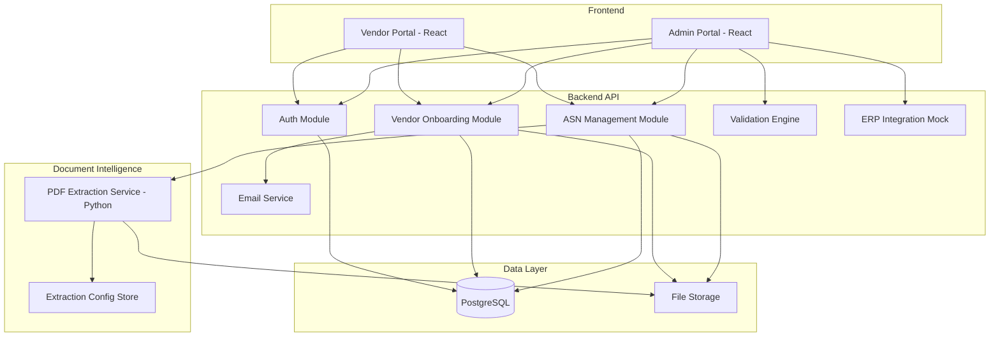
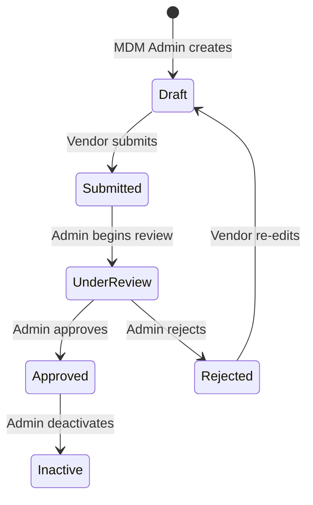
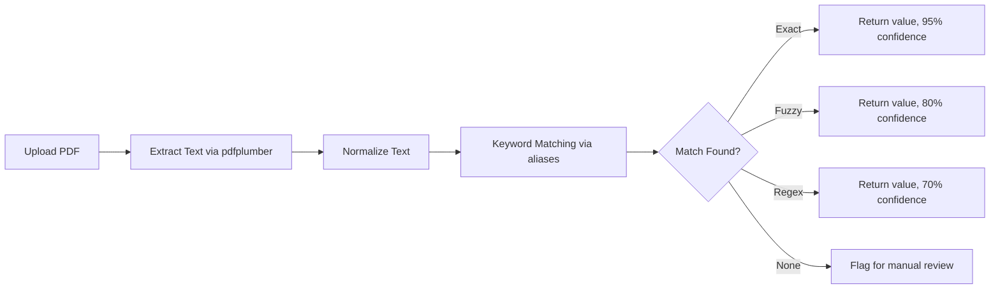

# Design Document: Vendor Onboarding & ASN Management System

## Overview

This system is a full-stack web application implementing a Vendor Management & Procurement Collaboration Platform. It consists of a backend API server, a frontend web application (Vendor Portal + Admin Portal), a Document Intelligence microservice for PDF extraction, and a database layer for persistence.

The architecture follows a modular monolith approach for the backend with a separate Python microservice for document intelligence, enabling independent scaling of the CPU-intensive PDF processing.

## Architecture



### Technology Stack

| Layer | Technology | Rationale |
|-------|-----------|-----------|
| Frontend | React + JavaScript (JSX) + Ant Design 5 | Matches D2D reference UI, rich component library |
| UI Icons | @ant-design/icons | Consistent iconography |
| Charts | Recharts | Dashboard visualizations |
| Backend API | Node.js + Express (JavaScript) | Simple, fast development |
| Document Intelligence | Python + FastAPI | pdfplumber ecosystem, rapidfuzz for matching (PDF extraction only) |
| Database | MySQL 8 (127.0.0.1:3306, root/Root@123) | Relational data, JSON columns for flexible fields |
| File Storage | Local filesystem (Phase 1) | Simple, upgradeable to S3 later |
| Email | Nodemailer (SMTP) | Lightweight, configurable |
| Authentication | JWT + bcrypt | Stateless auth, secure password hashing |
| HTTP Client | Axios | API communication from frontend |
| Date Handling | dayjs | Lightweight date formatting |
| Routing | react-router-dom v6 | Client-side routing with nested layouts |

### UI/UX Design System (Based on D2D Reference)

The frontend follows the established D2D design patterns:

**Layout Pattern**:
- Collapsible dark-themed sidebar (Ant Design `Sider`, width 220px) with grouped menu items
- White header bar with app title, user avatar, role badge, and logout dropdown
- Content area with 24px margin

**Page Patterns**:
- **List View**: Page title + action button (top-right) → Filter card (search inputs in a Row) → Ant Design Table with pagination, clickable rows to open detail
- **Detail View**: Back button + title + status tags → Tabs (Overview, Documents) → Card grid with Statistic components and info cards
- **Form View**: Back button + title → Card containing Form with `layout="vertical"` → Sections separated by `Title level={5}` → Row/Col grid (gutter 16) → Save/Cancel buttons at bottom
- **Multi-step Form**: Steps component at top → Card with step content → Previous/Next navigation at bottom

**Component Conventions**:
- Form labels use `<span>Label<span className="form-label-desc">Helper text</span></span>` pattern
- Inputs use `size="large"` for primary fields, default for others
- All inputs have 38px height, 6px border-radius (via global CSS)
- Select dropdowns use `showSearch` with `optionFilterProp="label"`
- Status displayed as colored `Tag` components (green=active, red=inactive, orange=pending, blue=info, purple=special)
- Tables use `size="middle"`, hover highlight `#f0f7ff`, header background `#fafafa`
- Cards use 8px border-radius, subtle box-shadow
- Buttons use 6px border-radius, `font-weight: 500`

**Navigation Pattern**:
- Sidebar menu items grouped under collapsible sub-menus (Masters, Operations, etc.)
- Active menu item highlighted, parent group auto-expanded based on current route
- `useNavigate` + `useLocation` for programmatic navigation

**State Management**:
- Local component state with `useState` hooks
- API calls via centralized axios instance with auth token interceptor
- Token stored in `localStorage`

**Shared Components**:
- `AttachmentsPanel`: Reusable file upload/list/preview/delete for any entity
- `FilterPanel`: Configurable filter row with date range, select, text inputs
- `AppLayout`: Sidebar + Header + Content outlet

## Components and Interfaces

### 1. Authentication Module

**Responsibilities**: User login, password management, JWT token issuance, role-based access control.

**API Endpoints**:
- `POST /api/auth/login` — Authenticate user, return JWT
- `POST /api/auth/reset-password` — Force password reset on first login
- `GET /api/auth/me` — Get current user profile

**Interfaces**:
```typescript
interface LoginRequest {
  email: string;
  password: string;
}

interface AuthResponse {
  token: string;
  user: { id: string; email: string; role: Role; mustResetPassword: boolean };
}

type Role = 'mdm_admin' | 'vendor' | 'procurement_admin';
```

### 2. Vendor Onboarding Module

**Responsibilities**: Vendor CRUD, onboarding workflow state machine, email triggers, self-service data capture.

**API Endpoints**:
- `POST /api/vendors` — Create vendor (MDM Admin)
- `GET /api/vendors` — List vendors with status filter (Admin)
- `GET /api/vendors/:id` — Get vendor details
- `PUT /api/vendors/:id/onboarding` — Update vendor self-onboarding data (Vendor)
- `POST /api/vendors/:id/submit` — Submit for approval (Vendor)
- `POST /api/vendors/:id/approve` — Approve vendor (Admin)
- `POST /api/vendors/:id/reject` — Reject vendor with reason (Admin)
- `PUT /api/vendors/:id/deactivate` — Soft delete (Admin)

**Workflow State Machine**:


### 3. ASN Management Module

**Responsibilities**: ASN creation, line-item handling, partial shipment support, status tracking.

**API Endpoints**:
- `POST /api/asns` — Create ASN (Vendor)
- `GET /api/asns` — List ASNs (filtered by role)
- `GET /api/asns/:id` — Get ASN details
- `PUT /api/asns/:id` — Update ASN
- `POST /api/asns/:id/submit` — Submit ASN (Vendor)
- `POST /api/asns/:id/validate` — Validate ASN (Admin)
- `POST /api/asns/:id/approve` — Approve ASN (Admin)
- `POST /api/asns/:id/reject` — Reject ASN (Admin)
- `POST /api/asns/:id/post` — Post to ERP (Admin)

### 4. Document Intelligence Service (Python)

**Responsibilities**: PDF text extraction, keyword matching, confidence scoring, configurable extraction rules.

**API Endpoints**:
- `POST /extract` — Extract fields from uploaded PDF
- `GET /config` — Get extraction configurations
- `POST /config` — Create/update extraction rule
- `DELETE /config/:id` — Remove extraction rule

**Extraction Pipeline**:


### 5. Validation Engine

**Responsibilities**: Compare extracted invoice data against PO and ASN records, detect mismatches.

**Interface**:
```typescript
interface ValidationResult {
  asnId: string;
  invoiceNumber: { extracted: string; expected: string; match: boolean };
  lineItems: LineItemValidation[];
  totalAmount: { extracted: number; expected: number; match: boolean };
  overallStatus: 'valid' | 'has_discrepancies';
}

interface LineItemValidation {
  lineNumber: number;
  quantity: { extracted: number; expected: number; match: boolean };
  amount: { extracted: number; expected: number; match: boolean };
}
```

### 6. ERP Integration (Mock)

**Responsibilities**: Simulate ERP posting, track posting status.

**Interface**:
```typescript
interface ERPPostingResult {
  asnId: string;
  status: 'posted' | 'failed' | 'pending';
  message: string;
  timestamp: Date;
}
```

### 7. Email Service

**Responsibilities**: Send onboarding emails, rejection notifications.

**Interface**:
```typescript
interface EmailPayload {
  to: string;
  subject: string;
  template: 'onboarding' | 'rejection' | 'approval';
  data: Record<string, string>;
}
```

## Data Models

### Vendor
```typescript
interface Vendor {
  id: string;
  // Core MDM fields (not editable by vendor)
  vendorName: string;
  email: string;
  phone: string;
  companyName: string;
  department: string;
  supplierGroup: string;
  supplierCategory: string;
  supplierLocation: string;
  // Status
  status: 'draft' | 'submitted' | 'under_review' | 'approved' | 'rejected' | 'inactive';
  rejectionReason?: string;
  // Self-onboarding data
  onboardingData?: VendorOnboardingData;
  // Metadata
  createdAt: Date;
  updatedAt: Date;
  createdBy: string;
  mustResetPassword: boolean;
}

interface VendorOnboardingData {
  gstNumber: string;
  panNumber: string;
  tradeName: string;
  legalName: string;
  msmeType?: string;
  itrFilingStatus?: string;
  addresses: VendorAddress[];
  bankAccounts: BankAccount[];
  documents: VendorDocument[];
  contacts: ContactInfo;
}

interface VendorAddress {
  id: string;
  line1: string;
  line2?: string;
  city: string;
  state: string;
  country: string;
  pinCode: string;
  tags: ('billing' | 'shipping' | 'registered')[];
}

interface BankAccount {
  id: string;
  ifscCode: string;
  accountNumber: string;
  accountHolderName: string;
  bankName: string;
  branch: string;
  city: string;
  state: string;
  country: string;
}

interface VendorDocument {
  id: string;
  type: 'pan' | 'gst_certificate' | 'cin' | 'msme_certificate' | 'bank_proof' | 'other';
  fileName: string;
  filePath: string;
  uploadedAt: Date;
}

interface ContactInfo {
  phone1: string;
  phone2?: string;
  email1: string;
  email2?: string;
}
```

### Purchase Order
```typescript
interface PurchaseOrder {
  id: string;
  poNumber: string;
  vendorId: string;
  lineItems: POLineItem[];
  totalAmount: number;
  status: 'open' | 'partially_fulfilled' | 'fulfilled' | 'closed';
  createdAt: Date;
}

interface POLineItem {
  lineNumber: number;
  description: string;
  quantity: number;
  unitPrice: number;
  amount: number;
  fulfilledQuantity: number;
}
```

### ASN
```typescript
interface ASN {
  id: string;
  vendorId: string;
  purchaseOrderId: string;
  // Mandatory fields
  eta: Date;
  invoiceNumber: string;
  totalAmount: number;
  invoicePdfPath: string;
  lrNumber: string;
  transporterName: string;
  driverName: string;
  // Optional fields
  driverNumber?: string;
  referenceDocPath?: string;
  excelAttachmentPath?: string;
  remarks?: string;
  // Line items
  lineItems: ASNLineItem[];
  // Status
  status: 'draft' | 'submitted' | 'validated' | 'posted' | 'rejected';
  // Extraction results
  extractionResults?: ExtractionResult[];
  // Validation results
  validationResult?: ValidationResult;
  // ERP posting
  erpPostingStatus?: 'posted' | 'failed' | 'pending';
  erpPostingMessage?: string;
  // Metadata
  createdAt: Date;
  updatedAt: Date;
}

interface ASNLineItem {
  lineNumber: number;
  poLineNumber: number;
  description: string;
  quantity: number;
  amount: number;
}
```

### Extraction Configuration
```typescript
interface ExtractionConfig {
  id: string;
  fieldName: string;
  aliases: string[];
  regex?: string;
  priority: 'high' | 'medium' | 'low';
  createdAt: Date;
  updatedAt: Date;
}

interface ExtractionResult {
  fieldName: string;
  extractedValue: string | null;
  confidence: number; // 0-100
  matchType: 'exact' | 'fuzzy' | 'regex' | 'not_found';
  needsReview: boolean;
}
```


## Correctness Properties

*A property is a characteristic or behavior that should hold true across all valid executions of a system — essentially, a formal statement about what the system should do. Properties serve as the bridge between human-readable specifications and machine-verifiable correctness guarantees.*

### Property 1: Vendor creation succeeds if and only if all mandatory fields are valid

*For any* vendor creation request, the request succeeds (returns a vendor with a unique ID) if and only if all mandatory fields (Vendor Name, Email ID, Phone Number, Company Name, Department, Supplier Group, Supplier Category, Supplier Location) are present and the Email ID is a valid format. Any request missing a field or with an invalid email is rejected.

**Validates: Requirements 1.1, 1.2, 1.3, 1.4**

### Property 2: Generated passwords meet complexity requirements

*For any* generated onboarding password, it is exactly 10 characters long and contains at least one uppercase letter, one lowercase letter, one digit, and one special character.

**Validates: Requirements 2.2**

### Property 3: First-login password reset enforcement

*For any* vendor with `mustResetPassword=true`, attempting to access any protected endpoint (other than password reset) results in access denial until the password is reset.

**Validates: Requirements 3.1**

### Property 4: Authentication correctness

*For any* credential pair, authentication succeeds if and only if the email exists in the system and the password matches the stored hash. Invalid credentials always result in denial.

**Validates: Requirements 3.2, 3.3**

### Property 5: Vendor data isolation

*For any* two distinct vendors A and B, vendor A cannot read, modify, or access any data belonging to vendor B through any API endpoint.

**Validates: Requirements 3.4**

### Property 6: Core MDM fields are immutable by vendor

*For any* vendor update request submitted by a vendor, the core MDM fields (Vendor Name, Email ID, Phone Number, Company Name, Department, Supplier Group, Supplier Category, Supplier Location) remain unchanged regardless of what values are sent in the request.

**Validates: Requirements 4.6**

### Property 7: Multi-entity storage invariant

*For any* vendor adding N addresses (each with valid tags) or N bank accounts (each with all mandatory fields), the system stores exactly N entities, and retrieving the vendor returns all N entities with their original data intact.

**Validates: Requirements 4.2, 4.3, 4.4**

### Property 8: Onboarding submission validation

*For any* vendor submission missing at least one mandatory field (from business info, bank details, or required documents), the system rejects the submission and the vendor status remains unchanged.

**Validates: Requirements 4.5, 4.7**

### Property 9: Workflow state machine correctness

*For any* vendor or ASN entity, the system only allows valid state transitions: Draft→Submitted, Submitted→UnderReview, UnderReview→Approved, UnderReview→Rejected, Rejected→Draft, Approved→Inactive (for vendors); Draft→Submitted, Submitted→Validated, Validated→Posted (for ASNs). Any attempt at an invalid transition is rejected and the status remains unchanged.

**Validates: Requirements 5.1, 5.2, 5.3, 5.5, 6.6, 7.4**

### Property 10: Rejection requires reason

*For any* vendor rejection action, the rejection is completed only if a non-empty rejection reason is provided. Rejection attempts without a reason are rejected by the system.

**Validates: Requirements 5.4**

### Property 11: Soft delete preserves data

*For any* vendor marked as Inactive, the vendor record still exists in the database with all its data intact, and the status is 'inactive'.

**Validates: Requirements 5.7**

### Property 12: Invoice number global uniqueness

*For any* two ASNs in the system, their invoice numbers are different. Any attempt to create an ASN with an invoice number that already exists in the system is rejected.

**Validates: Requirements 6.3**

### Property 13: Partial shipment cumulative quantity invariant

*For any* Purchase Order and its associated ASNs, the sum of quantities across all ASN line items for a given PO line never exceeds the PO line's total quantity.

**Validates: Requirements 6.4, 6.5, 10.3**

### Property 14: Text normalization idempotence

*For any* input text, applying the normalization function (lowercase + collapse whitespace) twice produces the same result as applying it once: `normalize(normalize(text)) == normalize(text)`.

**Validates: Requirements 8.3**

### Property 15: Confidence score correctness

*For any* extraction result, the confidence score is exactly 95 when matchType is 'exact', 80 when matchType is 'fuzzy', 70 when matchType is 'regex', and 0 when matchType is 'not_found'. Additionally, `needsReview` is true if and only if matchType is 'not_found'.

**Validates: Requirements 8.4, 8.5**

### Property 16: Extraction config round-trip

*For any* valid extraction configuration (field name, aliases, regex, priority), storing it and then retrieving it produces an equivalent configuration object.

**Validates: Requirements 9.1**

### Property 17: Extraction config priority ordering

*For any* set of extraction configurations with different priorities, the extraction engine applies them in priority order (high before medium before low), and the first match wins.

**Validates: Requirements 9.3**

### Property 18: Invoice validation comparison correctness

*For any* invoice/PO/ASN triple, the validation engine correctly identifies a field as matching if and only if the extracted value equals the expected value, and flags all mismatches with the specific discrepancy details.

**Validates: Requirements 10.1, 10.2**

### Property 19: Keyword alias matching

*For any* extraction configuration with N aliases and any text containing one of those aliases followed by a value, the extraction engine finds and returns the value with the correct confidence score.

**Validates: Requirements 8.2, 9.2**

## Error Handling

### Authentication Errors
- Invalid credentials: Return 401 with generic "Invalid email or password" message (no information leakage)
- Expired JWT: Return 401 with "Token expired" and require re-authentication
- Insufficient permissions: Return 403 with "Access denied"

### Validation Errors
- Missing mandatory fields: Return 400 with array of field-level error messages
- Invalid email format: Return 400 with specific format error
- Duplicate invoice number: Return 409 with "Invoice number already exists"
- Invalid state transition: Return 422 with "Invalid status transition from {current} to {target}"

### File Upload Errors
- File too large: Return 413 with size limit information
- Invalid file type: Return 400 with accepted types list
- Upload failure: Return 500, log error, allow retry

### Document Intelligence Errors
- PDF parsing failure: Return extraction results with all fields marked as `not_found` and `needsReview: true`
- Invalid regex in config: Return 400 when saving config, with regex error details
- Service unavailable: Return 503, queue for retry

### ERP Integration Errors
- Posting simulation failure: Log failure, set status to 'failed', allow retry
- All errors logged with correlation IDs for traceability

## Testing Strategy

### Unit Testing
- **Framework**: Jest (TypeScript backend), pytest (Python service)
- **Coverage targets**: Core business logic, validation functions, state machine transitions
- **Focus areas**:
  - Field validation logic (email format, mandatory fields)
  - State machine transition rules
  - Password generation
  - Text normalization
  - Confidence score calculation

### Property-Based Testing
- **Framework**: fast-check (TypeScript), Hypothesis (Python)
- **Minimum iterations**: 100 per property
- **Tag format**: `Feature: vendor-onboarding-asn-management, Property {number}: {title}`
- **Each correctness property maps to exactly one property-based test**

### Integration Testing
- API endpoint testing with supertest
- Database integration tests with test containers
- End-to-end workflow tests (vendor creation → email → login → onboarding → approval)

### Test Organization
```
backend/
  src/
    modules/
      auth/
        auth.service.ts
        auth.service.test.ts
        auth.properties.test.ts
      vendor/
        vendor.service.ts
        vendor.service.test.ts
        vendor.properties.test.ts
      asn/
        asn.service.ts
        asn.service.test.ts
        asn.properties.test.ts
      validation/
        validation.service.ts
        validation.properties.test.ts

document-intelligence/
  src/
    extraction/
      extractor.py
      test_extractor.py
      test_extractor_properties.py
    config/
      config_store.py
      test_config_properties.py
```
